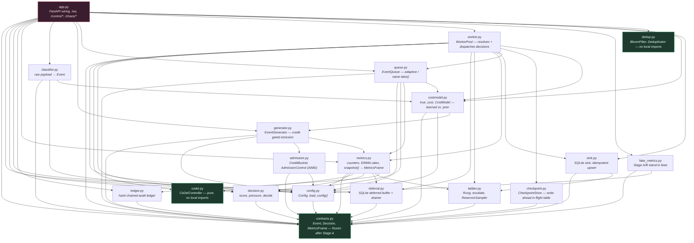
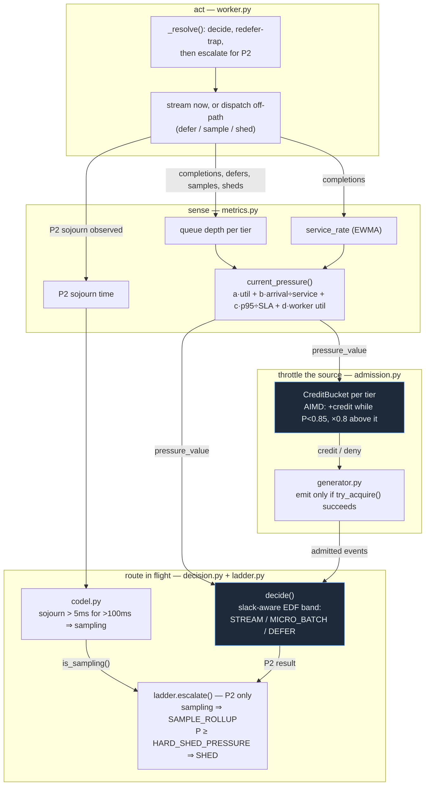
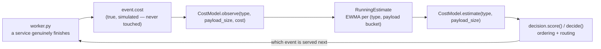

# PULSE — architecture

Two views of the same system: the **component graph** (what depends on
what, and in which direction) and the **control loop** (how pressure,
credits, and the ladder actually govern behaviour once the process is
running). Neither is the pipeline diagram most triage systems reach for —
see "why a feedback system, not a pipeline" below.

## Component diagram

`contracts.py` sits at the bottom with an in-degree from every other
module and an out-degree of zero — nothing it defines depends on anything
this project wrote. `codel.py` and `dedup.py` are the other two leaves:
`codel.py` takes a sojourn time and a clock and returns a boolean;
`dedup.py` takes a string key and returns a boolean; neither has ever
needed to know what an `Event` is, and Stage I built `dedup.py` to that
same independence standard on purpose (see
[ADR 0010](adr/0010-bloom-lru-over-persistent-dedup-store.md)).
`checkpoint.py` depends on nothing but `contracts.py` either, for the
same reason — a write-ahead in-flight table only ever needs to serialise
and hand back an `Event`, never to reason about queues, pressure, or
decisions. `app.py` sits at the top: it is the only module that imports
`generator`, `worker`, and `fake_metrics` together, because wiring them
into one running process is the one thing only `app.py` is allowed to do.

## Control loop

The pipeline is not "generator → queue → worker → sink." It is a
feedback system: worker throughput and queue depth produce a **pressure**
signal, pressure throttles **admission** at the edge and **escalates**
routing decisions in the middle, and both of those actions change future
throughput and queue depth — closing the loop.

Two feedback paths run at once, on different tiers and different
timescales:

- **Upstream, all tiers, AIMD-slow**: `admission.py` watches the same
  pressure signal and throttles the generator itself — additive increase
  while calm, a ×0.8 multiplicative cut the instant pressure crosses
  0.85. P0's own bucket is asymmetric on purpose (CLAUDE.md hard rule 3):
  it retains credit far longer, so *it* is never the one throttled — the
  ladder never even sees a P0 event whose only problem is volume.
- **In-flight, P2-only, CoDel-fast**: `codel.py` watches P2's own sojourn
  time, not a queue-length threshold, and flips into "sampling" the
  instant sojourn is genuinely elevated for a sustained interval (see
  [0006](adr/0006-sojourn-aqm-over-queue-length.md) for why sojourn, not
  depth). `ladder.escalate()` reads that boolean and CoDel's signal
  always wins over a raw pressure check — hard-shed is the fallback only
  when CoDel is *not* already sampling, not the first thing checked.

Both loops feed back through the same three numbers — queue depth,
service rate, P2 sojourn — recomputed by `metrics.py` on every tick, so
neither loop can starve or double-count against the other; they are two
consumers of one sensor, not two independent sensors that could disagree.

## A third feedback loop: online cost learning (Stage I)

A third loop, deliberately the slowest and the only strictly one-way one:
`worker.py` feeds `costmodel.py` the TRUE cost of every event it actually
finishes; `CostModel.estimate()` then changes how `decision.py` scores
and routes the NEXT comparison. One-way in the sense that matters most —
see [ADR 0011](adr/0011-online-cost-learning-over-static-or-bandit.md):
`observe()` never chooses what gets served, only how already-scheduled
traffic is weighed afterward, which is what keeps this loop from being a
bandit. The other two loops (admission, ladder) react within seconds;
this one is deliberately slower (an EWMA half-life of dozens of samples,
not milliseconds) because a cost estimate re-adapting instantly to one
noisy observation would make ordering decisions flicker for no real
reason — see `costmodel.py`'s own docstring for why the decay is keyed to
sample count, not wall-clock time, so responsiveness never degrades the
longer a demo has been running.

## Resilience paths, not control loops (Stage I)

Two more Stage I modules sit outside the pressure/admission/ladder/cost
feedback system entirely — they answer "did this actually happen exactly
once," not "what should happen next":

- **`checkpoint.py`** — a per-`WorkerPool`, write-ahead, in-memory table
  of which events a specific worker currently holds. `worker.py` writes
  to it immediately before the one `await` a worker's own death could
  land inside, and clears its entry immediately after. On a real death,
  `WorkerPool._on_worker_done()` recovers exactly what that worker still
  held and nothing else (see [ADR 0009](adr/0009-write-ahead-checkpoint-over-full-transaction-log.md)).
- **`dedup.py`** — a Bloom-filter candidate check backed by a bounded
  exact set, sitting in `Engine._ingest()` before an event ever reaches
  the queue. Every event passes through it, not just chaos-flood-injected
  ones (see [ADR 0010](adr/0010-bloom-lru-over-persistent-dedup-store.md)).

Both are exercised the same way a jury can watch: `POST
/chaos/kill-worker` and `POST /chaos/duplicate-flood` trigger the real
mechanisms directly, not a simulated stand-in for them, and
`bench/run.py`'s own `adaptive-spike-worker-kill`/
`adaptive-spike-duplicate-flood` configs run the identical real actions
headless, reporting `exactly_once_violations` as a column that reads 0 in
every row, chaos rows included.

## Why the module boundaries are where they are

Every boundary above splits along one question, not one pipeline stage:

- **`contracts.py` has zero project imports** because a schema that
  imports its own consumers cannot be frozen — freezing means nothing
  downstream can leak back into it, and Python's import graph is used
  here as the actual enforcement mechanism, not just a convention.
- **`codel.py` has zero project imports at all.** It answers one
  question — "has sojourn been elevated for a sustained interval?" —
  from two numbers (a duration and a clock reading), and answering that
  never requires knowing what an `Event`, a `Tier`, or a `Decision` is.
  Keeping it dependency-free is what makes it trivially unit-testable
  with a frozen clock and reusable as the same primitive some other
  system's AQM would use.
- **`decision.py` and `ladder.py` are two files, not one**, because they
  answer different questions on different inputs: `decide()` is a pure
  function of one event and the current pressure (see
  [0005](adr/0005-split-ordering-and-pressure-functions.md)); `escalate()`
  additionally needs CoDel's own state, which only exists because events
  sit in a real queue over real time. Merging them would make `decide()`
  — used everywhere, including inside `worker._resolve()`'s hot path —
  depend on queue-timing state it has no other reason to need.
- **`admission.py` and `ladder.py` both throttle, but never call each
  other.** They intervene at different points in the event's lifecycle
  (before it exists in the queue vs. after it is already dequeued) and
  own different failure modes (denying emission vs. degrading an
  in-flight event) — collapsing them would make one file responsible for
  both "should this be created" and "how should this already-real event
  be served," which is two different jobs with two different callers
  (`generator.py` and `worker.py` respectively).
- **`metrics.py` imports `codel`, `decision`, `deferral`, `ladder`, and
  `ledger` — the widest fan-in of any non-`app` module** — because it is
  the one place all of those signals must be reconciled into a single
  consistent `MetricsFrame` and a single conservation check
  (`ingested == processed + in_queue + in_flight + deferred_pending +
  sampled_out + shed`). Any of those five modules recomputing its own
  partial view of "current state" would be five sources of truth instead
  of one.
- **`app.py` is the only module allowed to import `generator`, `worker`,
  and `fake_metrics` together** — wiring a live engine together, and
  choosing between a real engine and the Stage A/B stand-in feed, is a
  process-composition decision, not a domain decision any lower module
  should need to make about itself.
- **`costmodel.py` is a separate file from `decision.py`, not a new
  function inside it.** `decision.py`'s own docstring already commits to
  staying pure and stateless — "only computes numbers... from numbers it
  is handed." A learned estimate is the opposite of that: state that
  changes over the life of a process, updated from real traffic. Keeping
  it in its own file (imported by `queue.py`/`worker.py`, handed to
  `decision.py`'s functions as a plain `cost: float` parameter) means
  `decision.py` never has to know an estimate exists at all — it is
  handed a number, exactly as it always was.
- **`checkpoint.py` is owned per-`WorkerPool`, not an ambient
  module-level singleton** like `sink.py`/`deferral.py`/`ledger.py` are.
  Those three are genuinely global concepts for this project (one audit
  trail, one deferred backlog, one durable sink, for the one pipeline
  CLAUDE.md hard rule 1 says exists per process); a table keyed by
  `worker_id` is scoped to one specific pool's own tasks instead, and
  sharing one global table across every `WorkerPool` a test constructs
  would let unrelated tests' reused event_ids collide — the opposite of
  what a per-instance store is for.

## Why the contract was frozen before implementation

See [ADR 0004](adr/0004-contract-first-freeze.md) for the full decision
record. In one sentence: `Event`, `Decision`, and `MetricsFrame` are the
one wire format every stage — engine, dashboard, and benchmark harness —
has to agree on, and a field discovered missing at hour 20 costs an order
of magnitude more than the same field designed in at hour 1, so every
field any later stage would need (`pressure`, `ladder_rung`,
`cost_adaptive`, and the rest) was named, typed, and defaulted in Stage A
before any of the logic that fills them in existed. `tests/test_contracts.py`
locks the frozen field set so a field quietly disappearing is a test
failure, not a demo-day surprise, and CLAUDE.md's own rule — stop and ask
before adding a field, never add one silently — is what has kept it
frozen every stage since.
