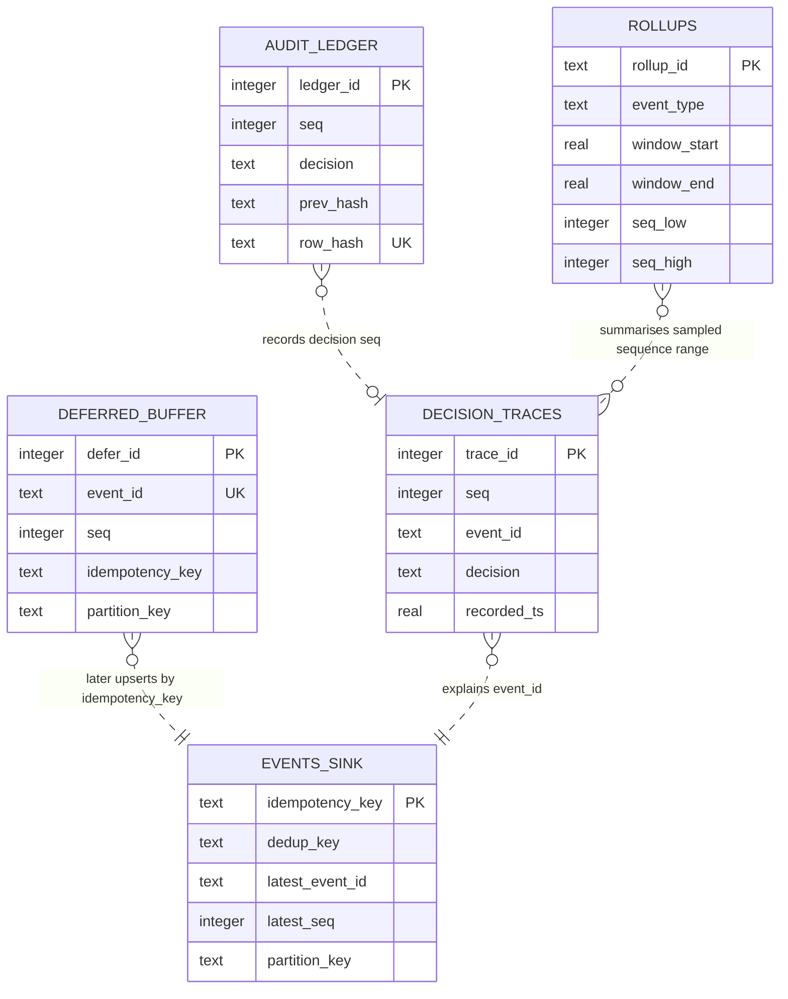

# PULSE data model

This document distinguishes the **event envelope** that travels through the
pipeline, the **MetricsFrame** delivered to the dashboard, and the durable
SQLite records used at the pipeline edges. The SQLite tables are design
contracts for later stages; no table implementation is added by this prompt.

## 1. Identity model: five fields, five jobs

An event has five deliberately distinct identity fields. They must not be
replaced with a catch-all `id`.

| Field | Identifies | Assigned by | Lifecycle under retry | Component that consumes it |
|---|---|---|---|---|
| `event_id` | One physical emission into this pipeline | Generator | **New** | Audit trail, decision trace UI, operational debugging |
| `dedup_key` | The underlying business fact | Generator | **Same** | Deduplicator |
| `seq` | This event's pipeline position | Classifier | **New** | Queue ordering, rollup coverage, audit ledger |
| `partition_key` | The ordering domain, normally a customer | Generator | **Same** | Per-partition ordering guard |
| `idempotency_key` | The terminal sink row to upsert | Classifier | **Same** | `events_sink` upsert / exactly-once check |

### Concrete retry failure if there were only one ID

Suppose payment `pay-91` is emitted with `event_id = evt-100` and its sink
attempt times out after the database commits. The retry is a new physical
emission, `event_id = evt-101`, but it represents the same business fact:
`dedup_key = payment:pay-91`, the same customer partition, and the same sink
upsert target.

If `event_id` and `dedup_key` were one field, there are two bad choices:

1. Reuse it on retry. The deduplicator sees the retry as a duplicate and
   suppresses it. The audit trail cannot distinguish the first emission from
   the retry or prove what happened.
2. Generate a new one on retry. The deduplicator sees a new business fact and
   allows a duplicate payment/order. If the sink uses that same field for
   idempotency, it can also write twice.

Five fields make the correct behavior explicit: deduplication uses
`dedup_key`, operational history uses `event_id`, ordering uses
`partition_key` + `seq`, and the sink upserts by `idempotency_key`.

## 2. Event envelope and evolving wire contracts

`Event` is the envelope metadata. It contains the five identities,
classification (`type`, `tier`), economics (`payload_size`, `value`, `cost`),
timestamps (`ingest_ts`, `deadline_ts`), and `schema_version`. The event body
must remain separate from that generic metadata:

```json
{
  "schema_version": 1,
  "event_id": "evt-100",
  "dedup_key": "payment:pay-91",
  "seq": 417,
  "partition_key": "customer:42",
  "idempotency_key": "payment:pay-91",
  "type": "payment",
  "tier": "P0",
  "payload_size": 384,
  "value": 120,
  "cost": 3.5,
  "ingest_ts": 1788500000.0,
  "deadline_ts": 1788500000.2,
  "payload": { "payment_ref": "pay-91", "amount": 2499 }
}
```

Metadata is what the generic scheduler needs; the payload is type-specific
business data that the scheduler must not understand. This lets the queue make
a decision without parsing payment details or click attributes. The sink can
persist the original body as JSON while indexing stable metadata separately.

`schema_version` describes the envelope version, not the database migration
version. A consumer can accept a newer additive envelope by ignoring unknown
payload properties, but must reject or route an incompatible version rather
than misinterpreting it.

### Why MetricsFrame begins with every dashboard field

`MetricsFrame` travels at 4 Hz from the backend to the dashboard. It contains
every field the UI is expected to need, with a zero/empty default from Stage A.
A field not yet measured is present with `0`, `{}`, or `[]`; it is never
omitted. The dashboard can therefore build a stable renderer before the
engine, ledger, sampler, and benchmark exist. Later stages fill values rather
than changing JSON shape and breaking the browser client.

Adding a genuinely new dashboard concept is consequently an explicit contract
change. The current frame already includes per-tier queue and latency values,
rates, ladder rungs, worker gauges, conservation counters, sampling fidelity,
benchmark costs, correctness counters, and recent decision/shed records.

## 3. Tier configuration is data

The five event types, their tiers, value, SLA, and simulated work-unit cost
live in `config/tiers.yaml`, together with traffic mix and worker capacity.
They are not Python constants. An operator can retune the policy, or the
benchmark can load a different scenario, without changing scheduler code.

The loader validates the mix and recalculates the three calibration
invariants. With the committed configuration, P0 spike demand is about
108 u/s (below 150 u/s capacity), total spike demand is about 288 u/s (above
capacity), and baseline is about 14.4 u/s. Changing a YAML number must make
these facts true again; it must not silently turn the demo into either an
unnecessary or impossible triage problem.

## 4. SQLite persistence design

SQLite is the single-process durable edge for the sink, deferred work, audit
trail, and rollups. `event_json` and `payload_json` are JSON text: SQLite does
not need to understand each payload subtype, while separately indexed columns
support the operational queries below.

All timestamps are UTC epoch seconds (`REAL`). `schema_version` is the stored
envelope version. SQL uses `event_type` where Pydantic uses `type` to avoid an
ambiguous generic column name in queries.

```sql
PRAGMA foreign_keys = ON;

-- Terminal, idempotent business result: one row per idempotency target.
CREATE TABLE IF NOT EXISTS events_sink (
    idempotency_key TEXT PRIMARY KEY,
    dedup_key TEXT NOT NULL,
    latest_event_id TEXT NOT NULL,
    latest_seq INTEGER NOT NULL,
    partition_key TEXT NOT NULL,
    event_type TEXT NOT NULL,
    tier TEXT NOT NULL CHECK (tier IN ('P0', 'P1', 'P2')),
    payload_json TEXT NOT NULL,
    schema_version INTEGER NOT NULL,
    first_ingest_ts REAL NOT NULL,
    committed_ts REAL NOT NULL,
    attempt_count INTEGER NOT NULL DEFAULT 1 CHECK (attempt_count >= 1)
);
CREATE INDEX IF NOT EXISTS idx_events_sink_dedup_key
    ON events_sink (dedup_key);
CREATE INDEX IF NOT EXISTS idx_events_sink_partition_seq
    ON events_sink (partition_key, latest_seq);
CREATE INDEX IF NOT EXISTS idx_events_sink_committed_ts
    ON events_sink (committed_ts);

-- P1/P2 work parked until capacity returns. P0 is forbidden in the database.
-- `origin` (Phase J6): 'local' rows came from THIS process's own in-process
-- worker.py (Engine's own pipeline, unchanged since Stage E); 'server2'
-- rows arrived over HTTP from a real, separate server2 instance (Phase
-- J5's own POST /defer). The two replay to different destinations — a
-- 'local' row re-enters Engine's own queue, a 'server2' row must go back
-- OVER THE WIRE to server2, never processed locally instead (that would
-- silently violate "P1/P2 -> Server 2"). Two independent drainers, one
-- per origin, run off this one table.
CREATE TABLE IF NOT EXISTS deferred_buffer (
    defer_id INTEGER PRIMARY KEY,
    event_id TEXT NOT NULL UNIQUE,
    dedup_key TEXT NOT NULL,
    seq INTEGER NOT NULL,
    partition_key TEXT NOT NULL,
    idempotency_key TEXT NOT NULL,
    event_type TEXT NOT NULL,
    tier TEXT NOT NULL CHECK (tier IN ('P1', 'P2')),
    deadline_ts REAL NOT NULL,
    deferred_ts REAL NOT NULL,
    ready_at REAL NOT NULL,
    defer_reason TEXT NOT NULL,
    event_json TEXT NOT NULL,
    schema_version INTEGER NOT NULL,
    origin TEXT NOT NULL DEFAULT 'local' CHECK (origin IN ('local', 'server2'))
);
CREATE INDEX IF NOT EXISTS idx_deferred_ready_priority
    ON deferred_buffer (ready_at, tier, deadline_ts, seq);
CREATE INDEX IF NOT EXISTS idx_deferred_partition_seq
    ON deferred_buffer (partition_key, seq);
CREATE INDEX IF NOT EXISTS idx_deferred_deadline
    ON deferred_buffer (deadline_ts);
CREATE INDEX IF NOT EXISTS idx_deferred_origin_ready
    ON deferred_buffer (origin, ready_at);

-- Append-only decision evidence. ledger_id defines hash-chain order.
CREATE TABLE IF NOT EXISTS audit_ledger (
    ledger_id INTEGER PRIMARY KEY,
    recorded_ts REAL NOT NULL,
    seq INTEGER NOT NULL,
    decision TEXT NOT NULL CHECK (decision IN
        ('STREAM_NOW', 'MICRO_BATCH', 'DEFER', 'SAMPLE_ROLLUP', 'SHED')),
    reason TEXT NOT NULL,
    pressure REAL NOT NULL,
    tier TEXT NOT NULL CHECK (tier IN ('P0', 'P1', 'P2')),
    prev_hash TEXT NOT NULL,
    row_hash TEXT NOT NULL UNIQUE
);
CREATE INDEX IF NOT EXISTS idx_audit_ledger_seq
    ON audit_ledger (seq);
CREATE INDEX IF NOT EXISTS idx_audit_ledger_tier_decision_ts
    ON audit_ledger (tier, decision, recorded_ts DESC);

-- Lossy representations of many lower-priority events in a fixed window.
CREATE TABLE IF NOT EXISTS rollups (
    rollup_id TEXT PRIMARY KEY,
    event_type TEXT NOT NULL,
    window_start REAL NOT NULL,
    window_end REAL NOT NULL CHECK (window_end > window_start),
    sample_weight REAL NOT NULL CHECK (sample_weight >= 1.0),
    observed_count INTEGER NOT NULL CHECK (observed_count >= 0),
    subtype_counts TEXT NOT NULL,
    seq_low INTEGER NOT NULL,
    seq_high INTEGER NOT NULL CHECK (seq_high >= seq_low),
    created_ts REAL NOT NULL,
    schema_version INTEGER NOT NULL
);
CREATE UNIQUE INDEX IF NOT EXISTS idx_rollups_type_window
    ON rollups (event_type, window_start, window_end);
CREATE INDEX IF NOT EXISTS idx_rollups_seq_coverage
    ON rollups (seq_low, seq_high);
CREATE INDEX IF NOT EXISTS idx_rollups_window
    ON rollups (window_start DESC, window_end DESC);

-- Short-horizon, query-friendly feed for the decision explanation panel.
-- Implemented (Phase J6): ledger.py durably inserts here on every
-- record_trace() call, pruned back to DECISION_TRACE_RETENTION (10,000)
-- rows every DECISION_TRACE_PRUNE_EVERY (500) inserts, alongside the
-- in-memory ring buffer this table was originally documented next to
-- (that buffer stays the dashboard's own fast, non-SQL path; this table
-- is what survives a restart).
CREATE TABLE IF NOT EXISTS decision_traces (
    trace_id INTEGER PRIMARY KEY,
    recorded_ts REAL NOT NULL,
    seq INTEGER NOT NULL,
    event_id TEXT NOT NULL,
    event_type TEXT NOT NULL,
    tier TEXT NOT NULL CHECK (tier IN ('P0', 'P1', 'P2')),
    decision TEXT NOT NULL CHECK (decision IN
        ('STREAM_NOW', 'MICRO_BATCH', 'DEFER', 'SAMPLE_ROLLUP', 'SHED')),
    reason TEXT NOT NULL,
    pressure REAL NOT NULL,
    value REAL NOT NULL
);
CREATE INDEX IF NOT EXISTS idx_decision_traces_recent
    ON decision_traces (recorded_ts DESC, trace_id DESC);
CREATE INDEX IF NOT EXISTS idx_decision_traces_tier_decision_ts
    ON decision_traces (tier, decision, recorded_ts DESC);
CREATE INDEX IF NOT EXISTS idx_decision_traces_event_id
    ON decision_traces (event_id);

-- Phase J6: "historical SLA outcomes" — one row per terminal completion,
-- durable and cross-process (unlike metrics.py's own sla_met/sla_missed,
-- which are in-memory, per-tier aggregates that reset on every
-- /control/reset). `source` names whichever process actually served the
-- event, so a query can ask "how did P0 do, specifically on server1"
-- rather than only "how did P0 do, in aggregate".
CREATE TABLE IF NOT EXISTS sla_outcomes (
    outcome_id INTEGER PRIMARY KEY,
    event_id TEXT NOT NULL,
    seq INTEGER NOT NULL,
    tier TEXT NOT NULL CHECK (tier IN ('P0', 'P1', 'P2')),
    event_type TEXT NOT NULL,
    value REAL NOT NULL,
    met INTEGER NOT NULL CHECK (met IN (0, 1)),
    latency_ms REAL NOT NULL,
    recorded_ts REAL NOT NULL,
    source TEXT NOT NULL CHECK (source IN ('ingress', 'server1', 'server2'))
);
CREATE INDEX IF NOT EXISTS idx_sla_outcomes_tier_met_ts
    ON sla_outcomes (tier, met, recorded_ts DESC);
CREATE INDEX IF NOT EXISTS idx_sla_outcomes_event_id
    ON sla_outcomes (event_id);
CREATE INDEX IF NOT EXISTS idx_sla_outcomes_source_ts
    ON sla_outcomes (source, recorded_ts DESC);
```

### Primary keys, indexes, and bounded growth

| Table | Primary key / invariant | Index and query served | Bounded-growth strategy |
|---|---|---|---|
| `events_sink` | `idempotency_key`; an upsert makes repeated delivery target one terminal result | PK: sink upsert; `dedup_key`: investigate/suppress business duplicates; `(partition_key, latest_seq)`: ordering audit; `committed_ts`: retention/export scan | Keep the active window; export verified historical results before pruning by `committed_ts`. This is not an unbounded event log. |
| `deferred_buffer` | `defer_id`; `event_id` unique (UPSERT on re-defer, Phase J6 — see below); `tier` check forbids P0 | `(ready_at, tier, deadline_ts, seq)`: eligible work in urgency order; `(partition_key, seq)`: order guard; `deadline_ts`: expiry/alert scan; `(origin, ready_at)`: each of the two per-origin drainers scans only its own rows | Explicit capacity cap. Delete only after successful sink persistence, rollup, or auditable shed. P0 cannot enter. |
| `audit_ledger` | `ledger_id` gives immutable chain order; `row_hash` unique | `seq`: trace one decision; `(tier, decision, recorded_ts)`: explain/shedding queries | Keep the 30-hour run. For longer operation, archive verified contiguous segments with their end hash and retain the checkpoint/root hash. |
| `rollups` | `rollup_id`; type/window unique index prevents duplicate window output | type/window: chart series; sequence coverage: reconcile an interval; window index: retention compaction | Fixed windows cap rows. Age out fine-grained windows only after compacting to a coarser rollup and retaining coverage bounds. |
| `decision_traces` | `trace_id` | recent: dashboard last-N feed; tier/decision: explain degradation; `event_id`: trace a retry/emission | Retain a bounded recent horizon, e.g. 10,000 rows. The ledger, not this convenience table, remains durable evidence. |
| `sla_outcomes` | `outcome_id` | `(tier, met, recorded_ts)`: attainment-over-time queries; `event_id`: trace one event's own outcome; `(source, recorded_ts)`: per-process attainment (Phase J6's own "how did server1 do" question) | One row per terminal completion; not deduplicated across a genuine retry (a retried event's own new completion is a real, separate fact worth keeping, matching `audit_ledger`'s own append-only stance). |

**`deferred_buffer.event_id` is UPSERTed, not merely unique (Phase J6).**
Once a deferred row can be redispatched back to a real, separate process
(`origin = 'server2'`) rather than only ever replayed into this same
process's own queue, a second DEFER of the same `event_id` — pressure still
high, or high again, by the time the redispatched event is re-decided — is a
real, reachable outcome, not a bug: the row is updated in place (new
`deferred_ts`/`ready_at`/`defer_reason`/`event_json`, same `defer_id`) rather
than the bare `INSERT` (pre-J6) raising a uniqueness violation.

## 5. Rollups: loss with accounting

`rollups` represents a group of lower-priority events, ordinarily P2, without
persisting each full payload.

| Field | Meaning |
|---|---|
| `rollup_id` | Stable identifier for one aggregate record |
| `event_type` | Aggregated type, such as `click` or `log` |
| `window_start`, `window_end` | The half-open window `[start, end)` |
| `sample_weight` | How many original events each observed event represents |
| `observed_count` | Number actually retained/observed in the window |
| `subtype_counts` | JSON object holding observed per-subtype counts |
| `seq_low`, `seq_high` | Inclusive sequence bounds spanned by the aggregate |

`sample_weight` is an expansion factor, not a sampling probability. If one in
ten clicks is represented, the stored weight is `10.0`. Downstream estimation
is:

```text
estimated_count = observed_count * sample_weight
```

Apply the same expansion to each observed `subtype_counts` value. It may be
fractional in an intermediate report; do not round every record early and
accumulate bias.

`seq_low` and `seq_high` are mandatory even though aggregation loses individual
payloads. The conservation equation must account for every emitted sequence:

```text
ingested = processed + in_queue + in_flight
         + deferred_pending + sampled_out + shed
```

Without sequence bounds, a rollup can claim it estimated 100 clicks but cannot
prove *which* sequence interval it represents. A missing range could hide
inside a rollup, or a range could be counted twice. Reconciliation compares
rollup coverage and `observed_count` with sampled-out counters and
decision/audit rows; overlap or an uncovered gap is evidence that the
conservation equation is lying.

## 6. Audit-ledger hash chain

For ledger row `n`, canonicalize and hash the following exact sequence:

```text
ledger_id | recorded_ts | seq | decision | reason | pressure | tier | prev_hash
```

`row_hash = SHA-256(canonical_bytes)`; `prev_hash` is the `row_hash` of row
`n - 1`. The genesis row uses a published constant, such as 64 zero hex
characters. Canonicalization means UTF-8 text, fixed separators, integer
decimal form, and a fixed decimal representation for `pressure`; otherwise
equivalent SQLite values could hash differently.

The chain detects a changed historical row, a deleted middle row, or an
inserted/reordered row when a verifier starts at the known genesis hash and
checks every link through a trusted current head hash. A shed decision is
therefore auditable with its decision, reason, and pressure.

It does **not** detect an attacker who rewrites both the database and the
trusted head hash/checkpoint, a false value recorded faithfully at decision
time, lost records before they are written, or corruption outside the ledger.
Publishing periodic head hashes to an independent system or signed demo
artifact strengthens this later; it is outside the single-process hackathon
scope.

## 7. Logical entity relationship model

The diagram shows logical relationships. The DDL avoids fragile foreign keys
from transient pre-sink/deferred records to a terminal sink row; identity fields
and the ledger are the reconciliation mechanism.



## 8. Contract coverage audit — before the freeze

Checked against `src/triage/contracts.py` on 2026-09-04.

| Described contract surface | Present now | Notes |
|---|---|---|
| All 13 `Event` metadata fields | Yes | `event_id`, `dedup_key`, `seq`, `partition_key`, `idempotency_key`, `type`, `tier`, `payload_size`, `value`, `cost`, `ingest_ts`, `deadline_ts`, `schema_version` |
| Five `Decision` values | Yes | Exactly `STREAM_NOW`, `MICRO_BATCH`, `DEFER`, `SAMPLE_ROLLUP`, `SHED` |
| MetricsFrame fields discussed above | Yes | Per-tier fields, rates, counters, cost/fidelity fields, and decision/shed lists |
| Decision trace fields | Yes | `seq`, `event_id`, `type`, `tier`, `decision`, `reason`, `pressure`, `value`, `ts` |
| Shed record fields | Yes | `seq`, `event_id`, `type`, `tier`, `reason`, `pressure`, `value`, `ts` |

### Fields described here that do **not** exist in `contracts.py`

No production code is changed by this documentation prompt. These are the
items the team must decide on **before freezing** the contract:

1. **`payload`** — the envelope example requires a type-specific payload
   separate from metadata. `Event` has only `payload_size`; it cannot carry or
   serialize the payload itself.
2. **A rollup contract** — no Pydantic model owns `rollup_id`, `event_type`,
   `window_start`, `window_end`, `sample_weight`, `observed_count`,
   `subtype_counts`, `seq_low`, or `seq_high`.
3. **A durable ledger-entry contract** — no model owns `ledger_id`,
   `recorded_ts`, `prev_hash`, or `row_hash`. The Stage A in-memory stub only
   has the `record(seq, decision, reason, pressure, tier)` call shape.
4. **Deferred-buffer persistence fields** — `defer_id`, `ready_at`,
   `deferred_ts`, `defer_reason`, and `event_json` are not contracted.
5. **Sink persistence fields** — `latest_event_id`, `latest_seq`,
   `payload_json`, `first_ingest_ts`, `committed_ts`, and `attempt_count` are
   not contracted.
6. **Decision-trace persistence fields** — `trace_id` and `recorded_ts` do not
   exist under those names (`DecisionTrace.ts` is the wire timestamp).

The SQL alias `event_type` maps to existing `Event.type`; it is not a missing
event concept. Table-only columns do not necessarily belong in the wire
contract, but every one that crosses a module boundary must be modeled before
the freeze. The immediate material question is `payload`: without it, the
documented envelope is not representable by `Event`.

